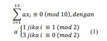

# Penerapan Aritmetika Modulo dalam Verifikasi Kode Batang European Article Number-13

European Article Number (EAN) digunakan untuk mengidentifikasi 
tipe produk retail. EAN-13 equivalen dengan kode batang UPC A yang digunakan di Amerika Serikat dan Kanada. European 
Article Number ini juga sering disebut sebagai International 
Article Number.

EAN Dapat diverifikasi dengan menggunakan aritmetika modulo. Digit-digit pada EAN-13 memiliki keunikan. Digit 
terakhir (check digit) ditentukan berdasarkan 12 digit 
sebelumnya. Jika posisi digit dilihat dari kiri yaitu 
mislkan digit-digit EAN-13 adalah dalam bentuk:
  
Check digit dipilih sedemikian sehingga memenuhi 
persamaan berikut 

## Cara menjalankan program
gcc ean.c
ean
